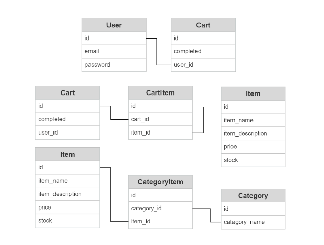

[![homepage][Logo]][Deployed Link]

The Debug Café “POS” (point-of-sale) is a web application designed to help facilitate online coffee shop orders and transactions. While its name implies its intended function for coffee shop orders, it can be used for a variety of other forms of retailing.

## Table of Contents

- [Technologies Used](#technologies)
- [Deployed Link](#link)
- [Usage](#usage)
- [Demo](#demo)
- [Developer Information](#developer)
- [Credits](#credits)
- [License](#license)
  

## Technologies

### Frontend:

- HTML
- CSS
- Javascript
- Fetch
- Bootstrap
- Figma
- Session Storage
- *[__Stripe__](https://stripe.com/docs/js)

### Backend:

- Node
- NPM
- Express
- MySQL
- Sequelize ORM  
- BCrypt
- Handlebars
- *[__Stripe__](https://stripe.com/docs/js)

*Since this is an e-commerce website, the application required credit card validation. This was done utilizing Stripe npm package.

## Link

[Visit The Debug Café here][Deployed Link]

## Usage

Simply access the deployed link above. If you are not logged in, you can still browse the available menu/catalog and the pricings of each item. However, you must be an authenticated user to make an order.

## Demo


<br>

### User Story
```md
As a user, I want to be able to browse through a menu of available items and their prices so that I can see if I want to order before having to login.

THEN I can see the descriptions of available items SO THAT I can see what it is before I make my order.

THEN I can create an order with a list of the items I’m about to purchase on the sidebar SO THAT I can keep track of my order and how much I am spending on them.

THEN I can checkout an order where I am directed to a page SO THAT I can confirm my checkout.
```
### Models

This project utilizes the MVC pattern that helps divide application logic into three main components: 
- The model,
- The view, and...
- The controller


Below is an image that displays how these components all interact with one another.


Every MVC uses models. Models are very important component because these objects carry all the necessary data need throughout the application.  The controllers (aka routes) contols the data flow into model object and updates the view whenever data changes. Below you can see the structure of the models implemented in this application.



### Code Snippets

For this application, handlebars was the template engine we utilized to dynamically generate HTML pages for the user. An efficent component that handlebars offers is the ability to utilize partials making it easier to reuse that code snippet throughtout other templates by calling on it. below is an example of a partial utilized in this project:

```html
<header>
    <div id="menu-image">
        <a href="/"></a>
    </div> 
    <nav id="homepage-navbar" type="button" class="btn btn-outline-secondary">
            <a href="/menu">Menu</a> |
            {{#if loggedIn}}    
            <a href="/account">My Account</a> |
            <a href="" id="logout">Logout</a>
            {{else}}
            <a href="/login">Login</a>
            {{/if}}
    </nav>
    
</header>
```

And here you can see it being called on in another template:


The code above is a perfect example of how handlebars template engine is useful in order to dynamically generate HTML. Here you can view how different menu items are displayed by their food/drink category. 

-------------------------------------------------------------------------------------------------
Unauthorized User && Authorized User

This helper function below allows to easily implement what a user can access before authenticating and what they are allowed to access once authorized. This function can be called inside any route needed, once implement the user will be redirected if they attempt to access information that is only available to authorized users.

```java
const withAuth = (req, res, next) => {
    if (!req.session.loggedIn) {
      res.redirect('/login');
    } else {
      next();
    }
};

module.exports = withAuth;
```

Below you can view the user being redirected to login, in order to be able to view a detailed menu and order online: 


Above you can also glance at the sidebar the will allow the user to add an item they would like to purchase. They can view the sidebar whenever needed once logged in and checkout when ready. 

The following code snippet, was used in order to add an event listener to the "add to cart" button and iterate through it and be able to add it to the sidebar, which is the cart. 

```java
document.addEventListener("DOMContentLoaded", function(event) { 
	var buttonEl = document.getElementsByClassName('addtocart')
	for (var i = 0 ; i < buttonEl.length; i++) {
		buttonEl[i].addEventListener('click' , addToCart ) ; 
	}
})
```

-------------------------------------------------------------------------------------------------
Order & Order confirmation

Below you can view how to fetch current order information inside cart and how the PUT method is utilized to update the the cart with the new item added to the order, which is an array of the items the user is going to purchase.


Once the user is done ordering they can place their order and will be redirected to page where they will be asked to input their info as well as credit card information. If the user input is valid then the user will be redirected to the following page.


## Learning Objectives

... 

## Developer

### **Maverick Wong**
[LinkdIn](https://www.linkedin.com/in/maverick-wong-4488b4241/) |
[GitHub](https://github.com/maverickwong17)

### **Alejandra Izquierdo**
[LinkdIn](https://www.linkedin.com/in/alejandra-n-izquierdo-b8488516b/) |
[GitHub](https://github.com/alenambo02)

### **Clement Koo**
[LinkdIn](https://www.linkedin.com/in/clement-t-k-459322138/) |
[GitHub](https://github.com/C-K999)

## Credits

UCB - Coding Bootcamp


### Helpful resources in order to help implement Stripe npm package:

-[Video]: https://www.youtube.com/watch?v=mI_-1tbIXQI&t=2s 
-[MVC image]: https://www.visual-paradigm.com/guide/uml-unified-modeling-language/what-is-model-view-control-mvc/
-[Coffee image]: https://coffee.alexflipnote.dev/9EQBz-4RLvQ_coffee.jpg

## License

[](https://opensource.org/licenses/MIT)

---

© 2022 Maverick Wong, Alejandra Izquierdo, Clement Koo. All Rights Reserved.

[Logo]:  https://cdn.discordapp.com/attachments/1004083809429508196/1005365130462236763/cafe_image.png

[Deployed Link]: https://the-debug-cafe.herokuapp.com/